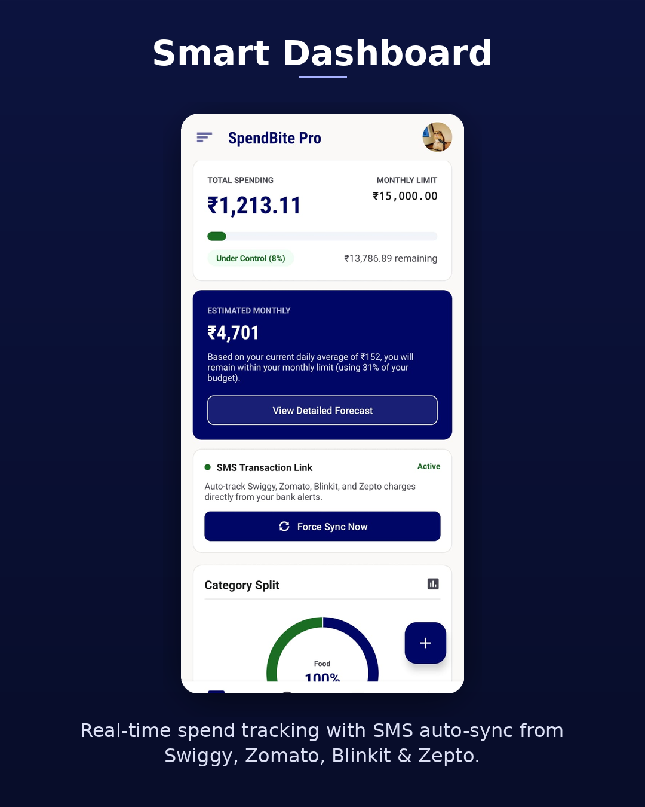
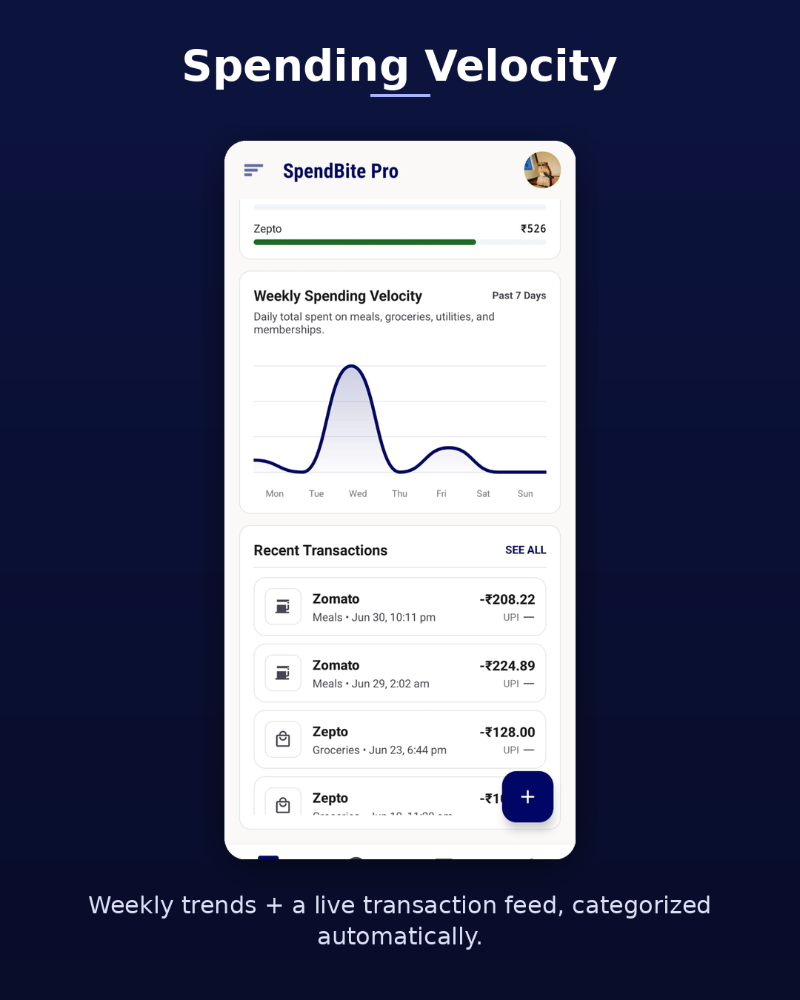
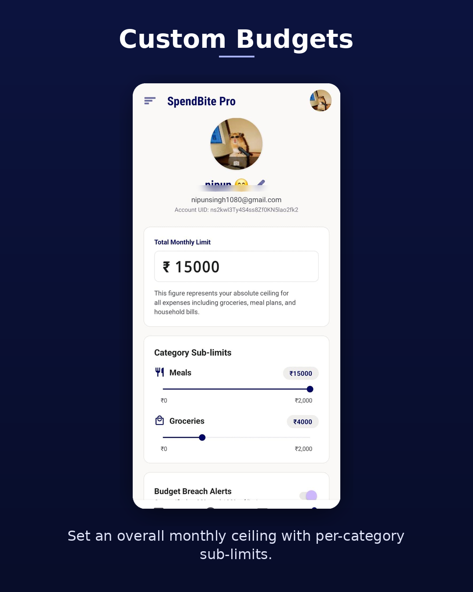
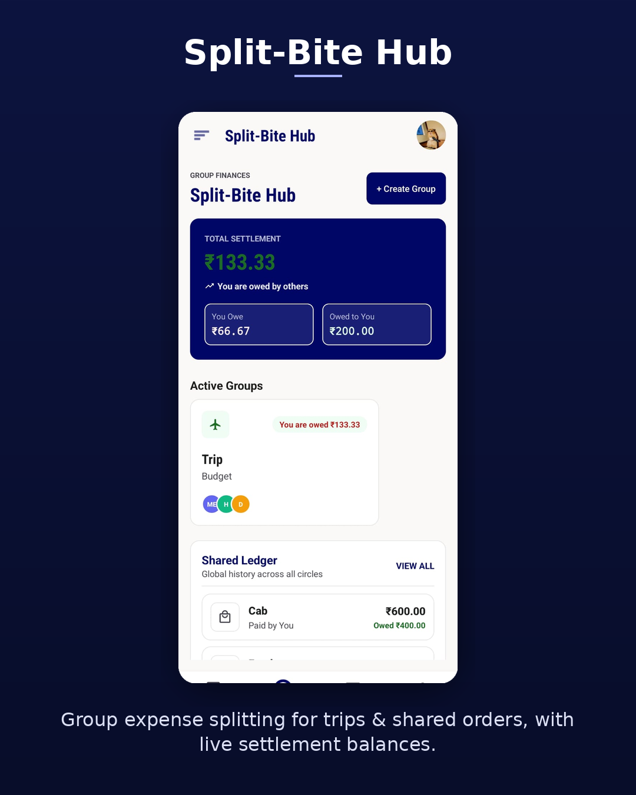
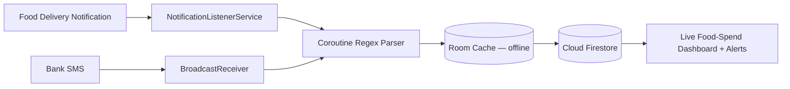

<div align="center">

# 💸 SpendBite
### Track every rupee you spend on food — automatically.

A Kotlin Android app that auto-tracks your food-delivery spending across Zomato, Swiggy, Blinkit & Zepto — **zero manual entry required.**


</div>

---

## 📌 Why SpendBite?

Food delivery is where budgets quietly bleed out — a ₹150 order here, a ₹300 order there, none of it ever added up until the bank statement shows up. Zomato, Swiggy, Blinkit, and Zepto don't expose a spending API, so every budgeting app makes you log each food order by hand. Nobody does that for long.

**SpendBite reads your food-order notifications and bank SMS, parses them automatically, and turns them into a live food-spend dashboard** — no manual ledger, no friction, just an honest picture of what food is actually costing you every month.

---

## ✨ Features

<table>
<tr>
<td width="50%" valign="top">

### 📊 Food Spend Dashboard
Real-time food-spend tracking with SMS auto-sync from Swiggy, Zomato, Blinkit & Zepto. See total food spend, monthly limit, and a live order-category split at a glance.



</td>
<td width="50%" valign="top">

### 📈 Order Spending Velocity
Weekly food-spend trends plus a live order feed, categorized automatically — spot the takeout spike before it becomes a habit.



</td>
</tr>
<tr>
<td width="50%" valign="top">

### 🎚️ Food Budget Limits
Set an overall monthly food-spend ceiling with per-category sub-limits (Meals vs. Groceries), plus configurable budget-breach alerts.



</td>
<td width="50%" valign="top">

### 🤝 Split-Bite Hub
Split food orders and shared meals with roommates or friends, with live settlement balances — know exactly who owes whom on the last group order.



</td>
</tr>
</table>

---

## 🧠 How the Food-Order Auto-Tracking Works



1. A `NotificationListenerService` silently intercepts order alerts from the Zomato, Swiggy, Blinkit, and Zepto apps.
2. A `BroadcastReceiver` parses transactional bank SMS as a backup signal for orders missed by notification parsing.
3. Off-thread Coroutine + Regex extractors pull out merchant, amount, and timestamp for each food order.
4. Data lands in a local Room cache first (offline-safe), then syncs to Firestore.
5. The dashboard listens in real time and recalculates food budgets, forecasts, and alerts instantly.

---

## 🏗️ Tech Stack & Architecture

| Layer | Tech |
|---|---|
| **Language** | Kotlin |
| **UI** | XML Layouts + ViewBinding |
| **Architecture** | MVVM (Model – View – ViewModel – Repository) |
| **Backend** | Firebase Authentication, Cloud Firestore, Cloud Messaging (FCM) |
| **Offline Cache** | Room |
| **Async** | Kotlin Coroutines + Flow |
| **Charts** | MPAndroidChart |

```
View (Activity/Fragment) ⇄ ViewModel ⇄ Repository ⇄ Firebase / Room
```

- The View layer only observes state — no business logic lives there.
- ViewModels expose `StateFlow` and survive configuration changes.
- The Repository is the single source of truth, abstracting Firestore + Room.

---

## 📱 Screens

| # | Screen | Purpose |
|---|---|---|
| 1 | Splash | Branding + session check |
| 2 | Login | Email/password + Google Sign-In |
| 3 | Create Account | Sign-up with validation |
| 4 | Forgot Password | Firebase reset-link flow |
| 5 | Dashboard | Live food-spend analytics + forecasts |
| 6 | Transaction Detail / Manual Add | Reclassify or manually log a food order |
| 7 | Budget Setup | Monthly food-spend limit + category sub-limits |
| 8 | Subscription ROI | Zomato Gold / Swiggy One profitability |
| 9 | Split-Bite Hub | Split food orders with roommates/friends |
| 10 | History | Full searchable/filterable log of past food orders |
| 11 | Profile | Account info, preferences, sign out |
| 12 | Notification Onboarding | Permission explainer for order auto-tracking |
| 13 | Home Screen Widget | At-a-glance food-budget health |

---

## 🚀 Getting Started

```bash
# Clone the repo
git clone https://github.com/NipunSingh999/spendbite-pro.git
cd spendbite-pro

# Open in Android Studio, then add your own google-services.json
# (Firebase Console → Project Settings → Add Android App)
```

1. Create a Firebase project and enable **Authentication** (Email/Password + Google), **Cloud Firestore**, and **Cloud Messaging**.
2. Drop your `google-services.json` into `/app`.
3. Build and run — grant Notification Access when prompted for auto-tracking to work.

---

## 🗺️ Roadmap

- [ ] UPI deep-link reconciliation
- [ ] Export monthly report as PDF
- [ ] Multi-currency support

---

## 📄 License

Distributed under the MIT License. See `LICENSE` for details.

---

<div align="center">

Built by **Nipun Singh** — Android & ML Engineer

</div>
