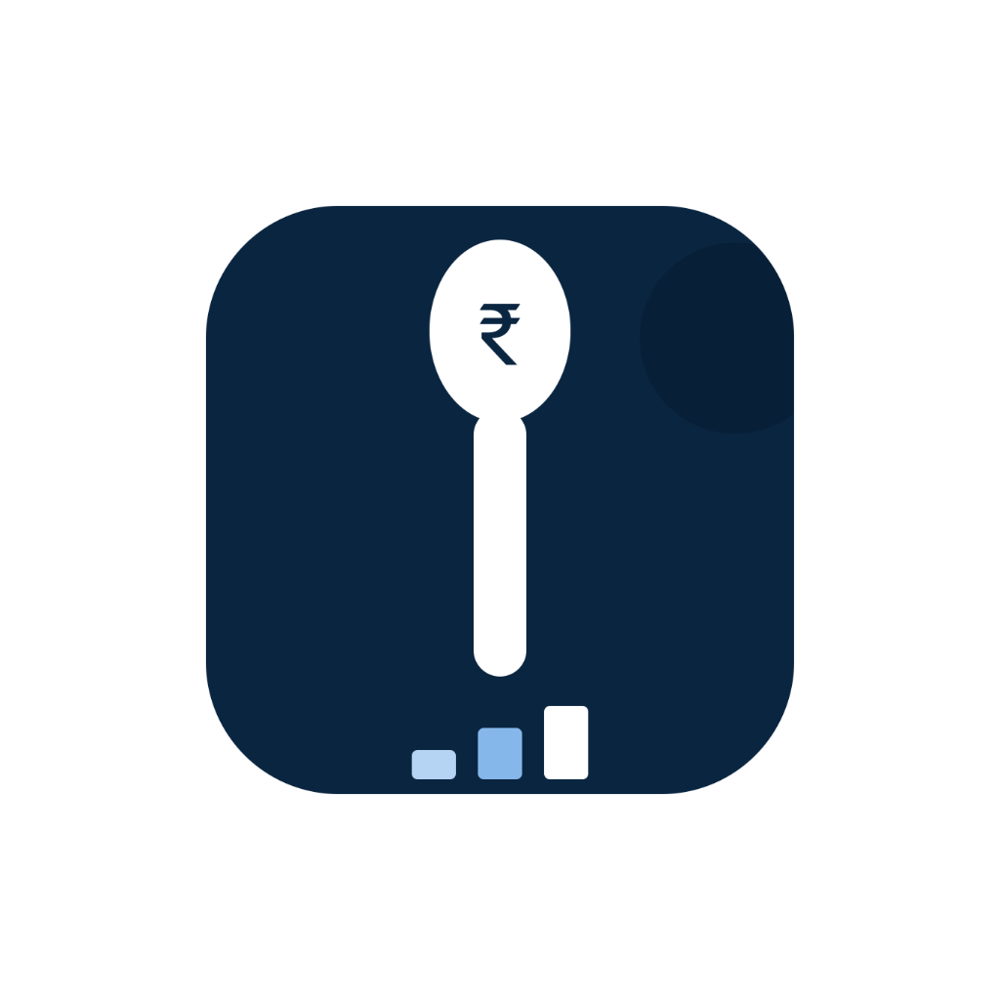

# 🍔 SpendBite

<p align="center">
  
</p>

<p align="center">
  <b>Automated Food & Grocery Budget Tracker with Dynamic Subscription ROI Insights</b>
</p>

<p align="center">
  
  
  
  
</p>

---

## ✨ Overview

Ever wondered if your **Zomato Gold** or **Swiggy One** subscription is actually saving you money, or just making you spend more? 

**SpendBite** solves this. It is a smart utility app that automatically syncs and parses your transaction SMS logs to log your food, grocery, utility, and discretionary spending in real-time. It then calculates the exact return on investment (ROI) of your memberships based on your actual order history.

---

## 🚀 Key Features

### 📡 Automated SMS Sync
No more manual entry! SpendBite runs a secure local receiver that parses incoming transaction SMS notifications and instantly categorizes them:
* 🍕 **Zomato / Swiggy** ➔ Food & Meals
* 🥕 **Blinkit / Zepto** ➔ Groceries
* 🏠 **Rent / Utilities** ➔ Fixed Bills
* 🛍️ **Discretionary** ➔ Fun & Lifestyle

### 📈 Real-Time Subscription ROI Tracker
Track your Swiggy One and Zomato Gold metrics dynamically:
* Calculates delivery fees waived, food discounts, and platform fee savings.
* Computes your **exact breakeven point** (e.g. *"Breakeven reached at Order #3"*).
* Live indicator badges (e.g., `PROFITABLE` or `NOT BREACHED YET`).

### 🎯 Bulletproof Monthly Budgeting
* Set a monthly budget limit.
* Monitor your spending with a colorful progress gauge (Green ➔ Amber ➔ Red).
* Smart warning notification alerts when you hit **80%** and **100%** of your limit.
* Toggle alerts on/off instantly via the settings profile.

### 📊 Beautiful Archives & Spending History
* **Interactive Donut Chart**: Touch categories to see percentage splits.
* **Weekly Trend Graphs**: High-performance custom views showing weekly velocity.
* **Month-over-Month Comparisons**: Custom vertical bar charts displaying historical comparisons.
* **Nested Month Expanders**: Tap any archive card to smoothly scroll transactions internally.

---

## 🛠️ Tech Stack

* **Language**: Kotlin
* **Architecture**: Jetpack Architecture Component (Fragments, ViewBinding)
* **Local Storage & Auth**: Firebase Firestore & Firebase Auth (with anonymous guest mode fallback)
* **Background Processing**: Broadcast Receivers & Android Worker Services
* **Custom UI Component**: Dynamic Canvas-drawn views for graphs and charts (DonutChartView, MonthlyBarChartView, TrendLineView)

---

## 💡 How It Works Under the Hood

### 1. SMS Parsing Engine
SpendBite listens for incoming SMS using a secure broadcast receiver. When a new message arrives from recognized delivery headers, it extracts the transaction details:
```text
"Sent Rs. 340 to Zomato using UPI. Remaining balance: Rs. 1500."
  ↳ Merchant: Zomato
  ↳ Amount: ₹340
  ↳ Category: Meals
```

### 2. Dynamic ROI Algorithm
The app sorts order transactions chronologically and runs a rules-engine for each membership:
* **Zomato Gold**: ₹40 delivery fee waived + 10% food discount (max ₹100) + ₹5 platform fee waived.
* **Swiggy One**: ₹35 food delivery fee waived / ₹30 Instamart delivery fee waived + 5% grocery discount (max ₹50) + ₹5 platform fee waived.

---

## ⚙️ Getting Started

### Prerequisites
* Android Studio (Koala/Ladybug or newer)
* Android SDK 34+
* Java Development Kit (JDK) 17+

### Local Setup
1. Clone this repository:
   ```bash
   git clone https://github.com/NipunSingh999/SpendBite.git
   ```
2. Open the project in Android Studio.
3. Create a project on the [Firebase Console](https://console.firebase.google.com/).
4. Add an Android App with package name `com.example.spendbitepro`.
5. Download your `google-services.json` and place it in the `/app` folder.
6. Enable **Anonymous Authentication** and **Cloud Firestore** in Firebase.
7. Build and run the app on your emulator or physical device!

---

## 🛡️ License

This project is licensed under the MIT License - see the [LICENSE](LICENSE) file for details.
